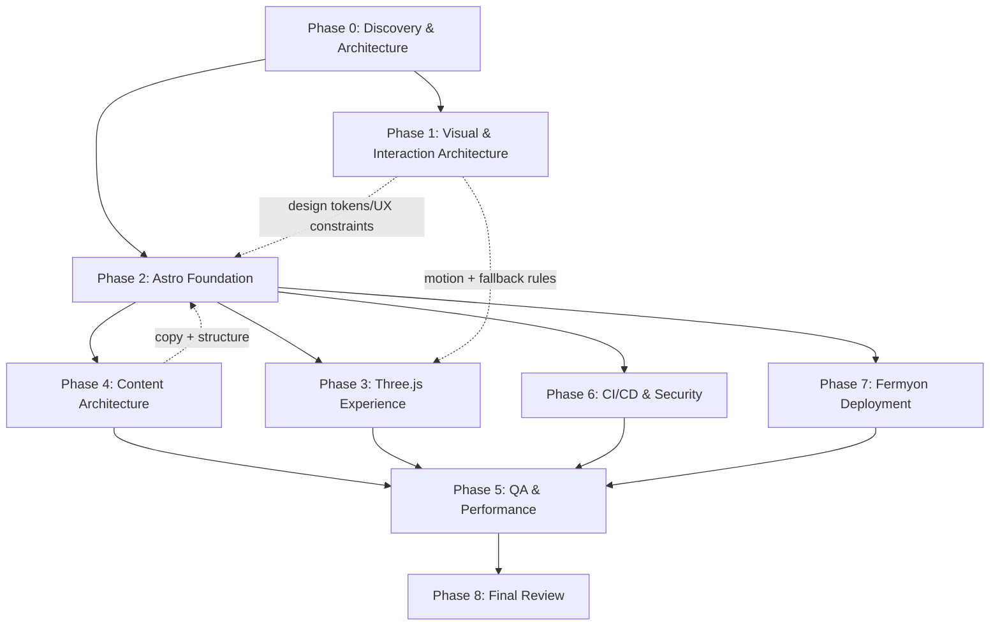

# Master Implementation Plan — Hybrid Cloud Control Room (guillermolam/cv)

## 1. Executive Summary
- Build a premium, recruiter-friendly, immersive portfolio for Guillermo Lam called **Hybrid Cloud Control Room**.
- Ship a **content-first Astro + TypeScript** experience where all essential content is semantic HTML and indexable; **motion is baseline** when it improves understanding; **Three.js is progressive enhancement** (spatial storytelling + navigation affordances, never the only way to access content).
- Support **full i18n for EN/ES/FR/DE** across core pages (About, CV, Portfolio, Contact, Blog landing), with language-aware content and SEO (hreflang, canonicals).
- Maintain **three deployment targets long-term**: Fermyon Cloud (Spin), Vercel, and GitHub Pages; keep CI safe (no secrets needed for PR validation).

## 2. Recommended Architecture
### 2.1 Runtime & Rendering
- **Astro-first**: serverless/static output (`output: 'static'` already set in [astro.config.mjs](file:///Users/guillermolammartin/Git/guillermolam/cv/astro.config.mjs)).
- **Progressive enhancement islands**: no framework by default; only add a client island for the 3D hero (vanilla Three.js).
- **Non-WebGL fallback**: HTML/CSS hero + “Control Room” narrative always visible; 3D canvas enhances, never blocks.
- **Reduced motion**: respects `prefers-reduced-motion`; animation becomes static/low-motion.

### 2.2 Information Architecture (IA)
- Primary routes (language scoped):  
  - `/{lang}/` (Control Room landing)  
  - `/{lang}/about`  
  - `/{lang}/cv` (+ CV downloads)  
  - `/{lang}/portfolio` (overview)  
  - `/{lang}/portfolio/security`  
  - `/{lang}/portfolio/infra`  
  - `/{lang}/portfolio/development`  
  - `/{lang}/case-studies/{slug}`  
  - `/{lang}/blog` and `/{lang}/blog/{slug}`  
  - `/{lang}/contact`
- Non-language root:
  - `/` acts as an English default landing (or a light language chooser) and links to `/en/`, `/es/`, `/fr/`, `/de/`.

### 2.3 Content Model
- Astro Content Collections under `src/content/**` as source of truth:
  - `profile` (single entry per lang)
  - `experience` (entries per lang; later support shared IDs + translated fields)
  - `projects` (tagged: security/infra/development; per lang summaries)
  - `caseStudies` (long-form; per lang, with shared `caseStudyId`)
  - `blog` (initially EN-first; optional translations later)
  - `certifications` (per lang labels, shared identifiers)
  - `cvFormats` metadata (Europass/ATS/one-page etc; links to PDFs in `public/cv/`)
- Preserve and reuse existing CV source material currently stored in `guillermo-lam-cv/src/parts/{lang}/**` as migration input.

### 2.4 Design System & UX Principles
- Visual metaphor: **operations command room** with calm, premium, technical minimalism.
- Avoid: SaaS dashboard clone, cloud console clone, cyberpunk HUD, crypto landing page aesthetics.
- Motion is a product feature:
  - use transitions, reveals, and environmental feedback to communicate hierarchy and system state
  - preserve a clear recruiter fast path (CV/contact) without delays
- Navigation is always clear and recruiter-friendly:
  - conventional header + footer nav remains present
  - “Control Room” adds optional spatial navigation cues, not the only nav

### 2.5 Three.js Integration (Vanilla)
- Isolated module boundary:
  - `src/components/hero3d/` for Three.js code and resources
  - `src/components/Hero3D.astro` wrapper for progressive enhancement
- Hard requirements:
  - capability checks (WebGL + perf heuristics)
  - resource disposal and lifecycle cleanup
  - lazy load on idle / after first paint where feasible
  - degrade on mobile and reduced motion

### 2.6 Deployment Targets (Long-term)
- **Fermyon Cloud**: package `dist/` via Spin static file server component.
- **Vercel**: deploy static output (`astro build`) as a static site.
- **GitHub Pages**: build and publish `dist/`.
- Existing repo currently contains legacy deployment assets for an older sub-project (see [deploy-cv.yaml](file:///Users/guillermolammartin/Git/guillermolam/cv/.github/workflows/deploy-cv.yaml) pointing to `./guillermo-lam-cv`). This must be refactored to the Astro root while preserving long-term multi-host support.

## 3. Agent Responsibility Matrix
### Portfolio Architect
- Owns: IA, narrative, recruiter journey, content model decisions, scope control, milestone acceptance criteria.
- Produces: IA doc, content taxonomy, case study templates, “Control Room” interaction spec (non-code).

### Visual Design Critic
- Owns: design system guidance, typography/spacing hierarchy, premium look and cohesion between 3D + content.
- Produces: design review notes, UI tokens guidance, polish backlog.

### Astro Portfolio Builder (astro-portfolio-implementation)
- Owns: Astro routes, layouts, components, i18n routing skeleton, content collection wiring, SEO components, CSS scaffolding.
- Must not: implement the full Three.js scene internals beyond integration boundaries.

### Three.js Cloud Control Room Developer (threejs-control-room)
- Owns: Three.js scene implementation, progressive enhancement, fallback logic, reduced-motion and mobile behavior, cleanup and performance.
- Must not: move unrelated Astro routes/content.

### CV Content Architect
- Owns: migrating existing CV markdown into content collections, writing/cleaning recruiter-friendly copy, certifications, CV formats, case studies structure.
- Must not: add new employers/roles/dates/metrics not present in source; mark uncertainties explicitly.

### LinkedIn Sync Assistant
- Owns: manual-only LinkedIn sync documents and draft copy derived from portfolio content; no automation.

### QA & Performance Validator
- Owns: build/check/test execution, accessibility smoke checks, WebGL fallback checks, mobile responsiveness checks, Playwright smoke suites.

### DevSecOps CI Builder
- Owns: GitHub Actions CI, security scans (gitleaks/trivy/dependency audits), safe permissions, PR validation.
- Also owns: aligning multi-host deploy workflows to new Astro root (except Fermyon-specific workflow).

### Fermyon Deploy Agent
- Owns: Spin packaging, `spin.toml`, Fermyon Cloud deploy docs and workflow (token via secrets).

### PR Final Reviewer
- Owns: final diff review, merge readiness, final command validation, PR title/body, follow-ups.

## 4. Dependency Graph


## 5. Phase Breakdown
### PHASE 0 — Project Discovery and Architecture
- **Goal**: lock IA, content model, i18n strategy, and scope boundaries for “Hybrid Cloud Control Room”.
- **Responsible agent**: portfolio-architect (lead), with input from visual-design-critic.
- **Inputs**
  - Repo state (existing Astro skeleton under `src/`)
  - Legacy CV content in `guillermo-lam-cv/src/parts/{lang}/**`
  - Critical requirements (accessibility/SEO/perf/fallback/i18n)
- **Outputs**
  - `docs/architecture/ia.md` (routes, navigation, recruiter journey)
  - `docs/architecture/content-model.md` (collections, schemas, translation strategy)
  - `docs/architecture/threejs-boundaries.md` (what 3D does/doesn’t do)
  - Milestone acceptance checklist
- **Files affected**: `docs/**` only
- **Validation requirements**
  - Human review: IA matches recruiter flow; scope excludes “console clone” look
- **Exit criteria**
  - IA frozen for v1; content model schema decisions frozen for implementation
- **Approval required**: Yes (explicit sign-off before Phase 2 implementation begins)

### PHASE 1 — Visual and Interaction Architecture
- **Goal**: define design system + interaction spec for the Control Room feel without copying the inspiration site.
- **Responsible agent**: visual-design-critic (lead), portfolio-architect (narrative constraints).
- **Inputs**
  - Phase 0 IA and constraints
  - Existing CSS baseline in [global.css](file:///Users/guillermolammartin/Git/guillermolam/cv/src/styles/global.css)
- **Outputs**
  - `docs/design/design-system.md` (typography scale, spacing, surfaces, focus states, motion rules)
  - `docs/design/control-room-interactions.md` (scene-to-content relationship, cues, CTA)
  - UI backlog: “premium polish” tasks prioritized
- **Files affected**: `docs/**` only
- **Validation requirements**
  - Accessibility review checklist embedded (contrast, focus, reduced motion)
- **Exit criteria**
  - Clear guidance for builders; no ambiguity about “not a dashboard / not cyberpunk”
- **Approval required**: Yes (sign-off before Three.js implementation)

### PHASE 2 — Astro Foundation
- **Goal**: build the production-ready Astro app foundation: i18n routing, SEO, content collections, components, styling architecture.
- **Responsible agent**: astro-portfolio-builder
- **Inputs**
  - Phase 0/1 docs
  - Existing pages: [index.astro](file:///Users/guillermolammartin/Git/guillermolam/cv/src/pages/index.astro), `about.astro`, `cv.astro`, `contact.astro`
- **Outputs**
  - Route restructuring for `/{lang}/...`
  - `src/content/config.ts` + initial collections
  - SEO component (title, description, canonical, hreflang, OG/Twitter)
  - Language switcher component
  - Navigation updated for language scoping
  - Non-WebGL hero fallback (premium, control-room narrative)
- **Files affected**
  - `src/pages/**`, `src/layouts/**`, `src/components/**`, `src/content/**`, `src/styles/**`
  - Potentially `.github/workflows/**` only if needed to keep CI green temporarily (prefer Phase 6)
- **Validation requirements**
  - `pnpm run check`
  - `pnpm run build`
  - `pnpm run test`
  - `pnpm run test:e2e` (Playwright smoke tests must be updated to new routes)
- **Exit criteria**
  - All core pages exist in EN/ES/FR/DE and are navigable without JS
  - SEO metadata correct; hreflang present; build is static
- **Approval required**: No (but publish a short review note after major routing change)

### PHASE 3 — ThreeJS Experience Implementation
- **Goal**: implement the Hybrid Cloud Control Room 3D hero as progressive enhancement and optional navigation “layer”.
- **Responsible agent**: threejs-cloud-control-room-developer
- **Inputs**
  - Phase 1 interaction spec + motion rules
  - Phase 2 component boundary (`Hero3D.astro` wrapper + fallback hero)
- **Outputs**
  - Three.js scene module (vanilla) with:
    - capability detection, lazy load, cleanup/disposal
    - reduced-motion mode
    - mobile-safe rendering and touch behavior
    - non-WebGL fallback preserved
  - Minimal telemetry hooks (non-invasive): e.g., only local console-free diagnostics during dev
- **Files affected**
  - `src/components/hero3d/**`, `src/components/Hero3D.astro`
  - Small edits to `src/pages/{lang}/index.astro` and `src/styles/**` for integration
- **Validation requirements**
  - Playwright: no console errors across all languages (extend existing tests in `e2e/`)
  - Manual checks: reduced-motion, WebGL-disabled browser fallback, mobile viewport
- **Exit criteria**
  - Home page is fully usable without WebGL; 3D adds “wow” without harming readability
- **Approval required**: Yes (explicit sign-off on motion + aesthetics before broader rollout)

### PHASE 4 — Content Architecture
- **Goal**: migrate and normalize CV/portfolio/certifications/case studies into structured collections with i18n support.
- **Responsible agent**: cv-content-architect (lead); linkedin-sync-assistant (sync artifacts).
- **Inputs**
  - Legacy CV markdown sources in `guillermo-lam-cv/src/parts/{lang}/**`
  - Phase 0 content model
- **Outputs**
  - `src/content/**` filled with structured entries per language
  - CV downloads metadata (PDF placeholders acceptable; “Coming soon” states if missing)
  - Case study templates + at least 1–2 “flagship” case studies
  - `docs/linkedin/**` manual sync docs + drafts (no automation)
- **Files affected**
  - `src/content/**`, `public/cv/**`, `docs/linkedin/**`
  - Minimal page tweaks for rendering new content
- **Validation requirements**
  - `pnpm run build` succeeds with all content
  - Content lint (basic): no broken internal links; dates are consistent
- **Exit criteria**
  - Portfolio sections populated and credible; all claims trace back to source
- **Approval required**: Yes (content accuracy sign-off)

### PHASE 5 — QA and Performance
- **Goal**: harden UX, accessibility, performance, and regression coverage.
- **Responsible agent**: qa-performance-validator
- **Inputs**
  - Completed Phase 2–4 work
  - Existing test harness: `vitest` + `playwright`
- **Outputs**
  - Expanded Playwright coverage:
    - language route coverage
    - reduced-motion behavior checks
    - non-WebGL fallback scenario (where feasible)
  - Performance checklist and remediation list (bundle size, 3D lazy loading)
  - Accessibility smoke checks documentation
- **Files affected**
  - `e2e/**`, `playwright.config.ts`, potentially small fixes in `src/**`
  - `docs/qa/**` reports
- **Validation requirements**
  - `pnpm run check && pnpm run build && pnpm run test && pnpm run test:e2e`
- **Exit criteria**
  - No console errors, core routes stable, mobile and reduced-motion pass
- **Approval required**: No (but produce a QA report summary)

### PHASE 6 — CI/CD and Security
- **Goal**: safe, strict CI for PRs + multi-host deployments without secret leakage.
- **Responsible agent**: devsecops-ci-builder
- **Inputs**
  - Existing workflows: [trunk-check.yaml](file:///Users/guillermolammartin/Git/guillermolam/cv/.github/workflows/trunk-check.yaml), [deploy-cv.yaml](file:///Users/guillermolammartin/Git/guillermolam/cv/.github/workflows/deploy-cv.yaml)
- **Outputs**
  - New/updated CI workflow:
    - install via pnpm
    - `astro check`, `astro build`, `vitest`, `playwright` (as appropriate)
    - minimal permissions
  - Security scanning (as agreed):
    - secret scanning (gitleaks) in CI
    - dependency audit
    - optional Trivy filesystem scan
  - Updated GitHub Pages workflow to build Astro root (not legacy subdir)
- **Files affected**
  - `.github/workflows/**`, `.gitignore`, `README.md` (commands documented)
- **Validation requirements**
  - CI passes on PRs without any deployment secrets
- **Exit criteria**
  - Reproducible CI gates; safe permissions; no `pull_request_target` misuse
- **Approval required**: Yes (security posture sign-off)

### PHASE 7 — Fermyon Deployment
- **Goal**: package Astro static output into Spin and deploy to Fermyon Cloud.
- **Responsible agent**: fermyon-deploy-agent
- **Inputs**
  - `astro build` output confirmed
  - CI safety constraints from Phase 6
- **Outputs**
  - `spin.toml` and docs for:
    - local `spin up`
    - `spin cloud deploy`
  - Optional GitHub Action `workflow_dispatch` deploy using `secrets.FERMYON_CLOUD_TOKEN`
- **Files affected**
  - `spin.toml`, `docs/deploy/fermyon.md`, optionally `.github/workflows/fermyon-*.yml`
- **Validation requirements**
  - `pnpm run build` then Spin serves `dist/` locally
  - Deployment workflow does not print tokens and is manual-triggered
- **Exit criteria**
  - Fermyon URL serves the same static site as local `dist/`
- **Approval required**: Yes (before enabling any automated deployments)

### PHASE 8 — Final Review
- **Goal**: ensure merge readiness and “world-class polish” checklist completion.
- **Responsible agent**: pr-final-reviewer
- **Inputs**
  - Everything from Phases 2–7
- **Outputs**
  - Final report: build/test results, risk list, follow-up issues
  - PR title/body (if applicable)
- **Files affected**: ideally none (only tiny fixes if strictly necessary)
- **Validation requirements**
  - Full local gates: `check`, `build`, `test`, `test:e2e`
  - Ensure no secrets, no generated files committed
- **Exit criteria**
  - Definition of Done satisfied
- **Approval required**: Yes (final merge/release sign-off)

## 6. Concurrency Opportunities
- Phase 0 and Phase 1 can proceed in parallel once basic scope is agreed:
  - portfolio-architect writes IA/content model docs while visual-design-critic drafts design system.
- After Phase 2 starts, allow parallel work with strict file boundaries:
  - **Three.js developer** works under `src/components/hero3d/**` while
  - **CV content architect** works under `src/content/**` and `docs/linkedin/**`.
- QA can start “incremental smoke” during Phase 2/3, but full QA gate is Phase 5.

### Do-Not-Edit-Simultaneously Rules (File Ownership Locks)
- `src/pages/**`, `src/layouts/**`: owned by astro-portfolio-builder (others propose changes via notes).
- `src/components/hero3d/**`: owned by threejs-cloud-control-room-developer.
- `src/content/**`, `public/cv/**`: owned by cv-content-architect (builder consumes via rendering).
- `.github/workflows/**`: owned by devsecops-ci-builder (except Fermyon workflow, owned by fermyon-deploy-agent).

## 7. Validation Gates
- **Gate A (Baseline health, before major refactors)**:
  - `pnpm run check && pnpm run build && pnpm run test && pnpm run test:e2e`
- **Gate B (After i18n routing restructure)**:
  - All `/{lang}/...` core routes load, no console errors, hreflang present
- **Gate C (After Three.js integration)**:
  - Reduced motion: no continuous animation loop
  - WebGL disabled: fallback hero visible, no broken layout
  - Mobile: canvas does not trap scroll; navigation remains usable
- **Gate D (Before enabling deployments)**:
  - CI green on PR without secrets; deployment workflows only run on approved triggers

## 8. Major Risks
- i18n scope creep (full translated blog/case studies can balloon): mitigate with EN-first long-form, translated summaries first.
- Three.js performance regression on mobile: mitigate with strict budgets, lazy-load, reduced detail, and hard fallback.
- Recruiter readability lost to immersion: mitigate with conventional nav + clear CTAs + content-first layout.
- Multi-host deployment drift: mitigate with a single build artifact (`dist/`) and host-specific minimal wrappers.
- Legacy sub-project confusion (`guillermo-lam-cv/`): mitigate by clearly documenting it as “legacy source archive” or moving to `docs/archive/` in a later clean-up milestone.

## 9. Definition of Done
- Core navigation and content exist in EN/ES/FR/DE for About/CV/Portfolio/Contact (Blog landing included; blog posts optional).
- Non-WebGL fallback is fully functional; no essential info requires canvas.
- `prefers-reduced-motion` is respected; motion is tasteful and optional.
- Static build passes (`astro build`) and pages are SEO-friendly (titles/descriptions/canonicals/hreflang).
- Playwright smoke tests cover all core routes and do not report console errors.
- CI validates PRs without secrets; security scans run and fail on real issues.
- Deployments work and are documented for:
  - Fermyon Cloud (Spin)
  - Vercel
  - GitHub Pages
- Repository documentation explains the Hybrid Cloud Control Room concept and maintenance workflow.

## 10. Exact Command to Execute Next
```bash
pnpm install && pnpm run check && pnpm run test && pnpm run test:e2e
```
