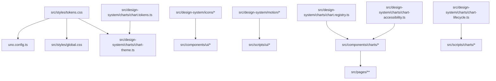

# Summary
Build a reusable Astro-native component library and design system for the portfolio, with:
- Astro components + TypeScript modules only (no React, no Tailwind, no UI-framework renderers).
- Styling via UnoCSS + CSS variables + component-scoped CSS.
- Motion via GSAP and/or Three.js, always gated by `prefers-reduced-motion`.
- Optional StreamlineHQ SVG icons for every reusable component, treated with 3.5D/3D depth (layered SVG + transforms / GSAP timelines / optional Three.js planes), never flat decoration.
- A Chart.js-based chart suite for data visualization only, progressively enhanced with accessible HTML fallbacks.

This plan is planning only (no code, no package installs). Implementation phases are split small, with explicit validation gates.

# Current State Analysis (Repo Truth)
## Project shape
- Astro static site (`output: 'static'`) in [astro.config.mjs](file:///Users/guillermolammartin/Git/guillermolam/cv/astro.config.mjs#L1-L9).
- Shared styling uses CSS variables and global CSS:
  - Tokens: [tokens.css](file:///Users/guillermolammartin/Git/guillermolam/cv/src/styles/tokens.css#L1-L131)
  - Global styles include many section/component blocks: [global.css](file:///Users/guillermolammartin/Git/guillermolam/cv/src/styles/global.css#L1-L866)
- Motion uses GSAP via progressive enhancement modules:
  - Homepage choreography: [home-motion.ts](file:///Users/guillermolammartin/Git/guillermolam/cv/src/scripts/home-motion.ts#L1-L152)
  - Component enhancement pattern: [TexturedButton.astro](file:///Users/guillermolammartin/Git/guillermolam/cv/src/components/TexturedButton.astro#L85-L88) + [textured-button.ts](file:///Users/guillermolammartin/Git/guillermolam/cv/src/scripts/textured-button.ts#L1-L93)
- Three.js is not currently used (no imports found); 3D is currently handled via `@google/model-viewer`.

## Dependencies (installed today)
From [package.json](file:///Users/guillermolammartin/Git/guillermolam/cv/package.json#L1-L33):
- Present: `astro`, `gsap`, `@astrojs/check`, `@google/model-viewer`, `typescript`.
- Missing (required by this plan): `three`, `unocss`, `@unocss/astro`, `nanostores`, `chart.js`.

## Existing conventions worth preserving
- Astro components are PascalCase; domain grouping exists under [src/components/control-room](file:///Users/guillermolammartin/Git/guillermolam/cv/src/components/control-room).
- Progressive enhancement boundary uses `data-*` attributes (e.g. [Hero3D.astro](file:///Users/guillermolammartin/Git/guillermolam/cv/src/components/Hero3D.astro#L11-L22)).
- Components can own their CSS via `<style>` blocks (e.g. [TexturedButton.astro](file:///Users/guillermolammartin/Git/guillermolam/cv/src/components/TexturedButton.astro#L90-L218)).

## Known issues / tech debt discovered during inspection
- Token mismatch:
  - `--color-accent` referenced but not defined in tokens ([TexturedButton.astro](file:///Users/guillermolammartin/Git/guillermolam/cv/src/components/TexturedButton.astro#L113-L175), [Avatar3D.astro](file:///Users/guillermolammartin/Git/guillermolam/cv/src/components/Avatar3D.astro#L87-L91)).
  - `--z-tooltip` referenced but not defined ([TexturedButton.astro](file:///Users/guillermolammartin/Git/guillermolam/cv/src/components/TexturedButton.astro#L185-L209)).
- Animation modules use broad style-coupled selectors (e.g. `.button`, `.nav a`) in [home-motion.ts](file:///Users/guillermolammartin/Git/guillermolam/cv/src/scripts/home-motion.ts#L102-L123). This makes motion brittle when markup changes.

# Constraints & Non-Negotiables (from request + existing spec)
- No React, no Tailwind, no framework wrappers.
- Essential content must remain indexable HTML (never only canvas/WebGL).
- Reduced-motion behavior is mandatory, meaningful, and must preserve usability.
- Motion must have narrative justification (aligns with [docs/spec.md](file:///Users/guillermolammartin/Git/guillermolam/cv/docs/spec.md#L14-L73)).
- Chart.js is allowed only for data visualization components; no wrapper libs.

# Ownership Boundaries (who owns what)
Primary ownership is by directory boundary (single owner per area):
- `src/styles/**`, `src/design-system/**`, `src/components/ui/**`, `src/components/charts/**`, `src/scripts/**`, `astro.config.mjs` → Astro implementation owner (Astro-native components, UnoCSS wiring, GSAP wiring).
- `src/components/control-room/**` (composite control-room sections) → Control-room implementation owner, but must consume UI primitives rather than re-invent them.
- Any future `src/three/**` or Three.js scene runtime → Three.js owner.
- `e2e/**` and QA gates → QA owner.
- CI updates (if needed for new checks) → CI owner.

Cross-cutting boundaries:
- Motion patterns/tokens system: define in design system; implement in components/scripts; validate via QA.
- Shared state: only when actually required; otherwise local state in DOM modules.

# Dependencies: Decision Table (required + evaluated)
## Version discovery rule (must happen before any dependency changes)
Before editing [package.json](file:///Users/guillermolammartin/Git/guillermolam/cv/package.json), run:
- `pnpm view astro version`
- `pnpm view gsap version`
- `pnpm view three version`
- `pnpm view unocss version`
- `pnpm view @unocss/astro version`
- `pnpm view nanostores version`
- `pnpm view chart.js version` (explicit requirement)
Then compare against versions in `package.json` / `pnpm-lock.yaml`.

## Decision table
| Dependency | Required | Current state | Why | How it’s used (policy) | Version check method | Decision |
|---|---:|---|---|---|---|---|
| `astro` | Yes | Installed (`^6.4.4`) | Core framework | Static output; no SSR unless approved | `pnpm view astro version` | Keep; update to latest stable if compatible |
| `gsap` | Yes | Installed (`^3.15.0`) | Motion choreography | Only when justified; gated by reduced motion; cleanup listeners | `pnpm view gsap version` | Keep; update to latest stable if compatible |
| `three` | Yes | Not installed | 3D spatial treatment + future hero | For scenes and 3D treatments only; never holds essential content | `pnpm view three version` | Add (runtime dep) |
| `unocss` | Yes | Not installed | Styling utilities | Must interop with CSS variables + scoped CSS | `pnpm view unocss version` | Add (dev dep) |
| `@unocss/astro` | Yes | Not installed | UnoCSS Astro integration | Add to `integrations` in `astro.config.*` per UnoCSS docs | `pnpm view @unocss/astro version` | Add (dev dep) |
| `nanostores` | Yes | Not installed | Shared state (only when needed) | No per-component state by default | `pnpm view nanostores version` | Add (runtime dep) |
| `chart.js` | Yes | Not installed | Charts only | Direct TS instantiation; progressive enhancement; strict cleanup | `pnpm view chart.js version` | Add (runtime dep) |
| `@unocss/reset` | Optional | Not installed | Reset CSS | Only if needed; must not fight existing base styles | `pnpm view @unocss/reset version` | Defer until UnoCSS baseline is measured |
| `barba.js` | Optional | Not installed | Route transitions | Only if Astro view transitions cannot meet needs | `pnpm view @barba/core version` | Reject for now (avoid extra runtime + complexity) |
| `vfx-js` | Optional | Not installed | Shader-like DOM effects | Only if Three.js/GSAP cannot cover required 3.5D effects | `pnpm view vfx-js version` | Reject for now |
| `fabricjs` / `penciljs` / `roughjs` | Optional | Not installed | Canvas/illustration | Conflicts with “no 2D-only components” goal unless strictly constrained | `pnpm view <pkg> version` | Reject for now |
| `astroanimate/astroanimate` | Inspiration | Not installed | Reference only | No dependency; do not copy architecture verbatim | N/A | No-install (reference only) |

## Explicitly forbidden dependencies
- `react-chartjs-2`, `vue-chartjs`, `svelte-chartjs`
- Any React/Vue/Svelte/Preact chart wrapper
- `chartjs-plugin-datalabels` unless explicitly justified for a specific chart and re-reviewed

# Proposed Design System Folder Structure (grounded + requested additions)
## Keep existing
- `src/styles/tokens.css` remains the canonical token source.
- `src/styles/global.css` remains but will be reduced over time to base/layout utilities.
- Domain composites remain under `src/components/control-room/**`.

## Add (requested)
- `src/design-system/charts/`
- `src/components/charts/`
- `e2e/charts/`

## Add (design-system foundation proposal)
- `src/design-system/foundation/` (tokens mappings, CSS variable contracts, depth/elevation helpers)
- `src/design-system/motion/` (motion tokens + GSAP choreography helpers)
- `src/design-system/icons/` (icon registry + 3.5D treatment helpers)
- `src/components/ui/` (reusable primitives + molecules)
- `src/scripts/charts/` (Chart.js progressive enhancement + lifecycle)
- `src/scripts/ui/` (component enhancement modules; data-attribute selectors only)

# Component Taxonomy (3.5D/3D by default)
## Layer 0 — Foundations (no UI)
- Tokens: CSS variables in `src/styles/tokens.css`
- UnoCSS config + shortcuts that map to CSS vars
- Motion tokens + easing contracts
- Icon registry + SVG optimization workflow

## Layer 1 — UI Primitives (reusable)
Examples (future):
- Buttons, links, chips, tags, badges, tooltips, panels, cards
- Each supports optional icon + all interaction microstates (hover in/out, press/release, focus, disabled)

## Layer 2 — Composites (domain components)
- Control-room composites (existing): briefing rail, station overlay, topology table
- These should be refactored to consume primitives rather than own bespoke CSS

## Layer 3 — Data Visualization (charts)
Chart components (required by request):
- `UiChartShell.astro`
- `UiBarChart.astro`
- `UiLineChart.astro`
- `UiRadarChart.astro`
- `UiDoughnutChart.astro`
- `UiSkillMatrixChart.astro`
- `UiExperienceTimelineChart.astro`
- `UiSecurityDomainRadar.astro`
- `UiToolchainDistributionChart.astro`

# Charts: Foundation Modules (required by request)
Create the following modules under `src/design-system/charts/`:
- `chart.tokens.ts`: chart-specific token mapping (colors, fonts, spacing) derived from CSS variables.
- `chart.registry.ts`: typed registry of chart types, variants, defaults, and allowed options.
- `chart-lifecycle.ts`: a small lifecycle controller interface (`mount`, `update`, `destroy`) + hooks for resize and navigation.
- `chart-accessibility.ts`: helpers to generate accessible titles, summaries, and fallback tables.
- `chart-theme.ts`: theme application layer (maps design tokens → Chart.js options).

# Charts: Component Props Contract (required)
All chart components must accept:
- `id`
- `class`
- `title`
- `description`
- `data`
- `labels`
- `datasetLabel`
- `chartType`
- `variant`
- `depth`
- `motion`
- `icon`
- `iconPosition`
- `iconLabel`
- `showLegend`
- `showTooltip`
- `showFallbackTable`
- `reducedMotionStrategy`
- `interactive`

Chart interaction states (must be represented as events or GSAP timeline labels):
- `chartEnter`, `chartLeave`
- `pointHoverIn`, `pointHoverOut`
- `legendHoverIn`, `legendHoverOut`
- `tooltipOpen`, `tooltipClose`
- `dataUpdate`, `resize`

# Chart.js Usage Policy (implementation requirements)
- Instantiate Chart.js directly from TypeScript modules (no wrappers).
- Progressive enhancement required:
  - Server-rendered HTML must include: accessible title, short summary, and table fallback or equivalent semantic data.
  - Canvas is never recruiter-critical single source of truth.
- Reduced-motion required:
  - If reduced motion is enabled, disable Chart.js animations (`options.animation = false`) and use non-animated updates.
- Cleanup required:
  - Destroy all chart instances on navigation/unmount.
  - Remove resize observers/listeners and tooltip handlers.
- 3.5D/3D treatment required for chart shell:
  - Container depth, legend, tooltip, and icon layer must follow the control-room depth language.
  - Canvas can remain 2D; everything around it must not be flat.

# Astro API Coverage (what we will and won’t use)
This plan explicitly maps the requested Astro extension points to scope:
- Integration API: In scope (UnoCSS integration; optional future internal integration for design-system dev tooling). UnoCSS Astro integration uses `@unocss/astro` per UnoCSS docs: https://unocss.dev/integrations/astro
- Adapter API: Out of scope (static output; no custom adapter planned).
- Renderer API: Out of scope (no UI framework renderers allowed).
- Content Loader API: Out of scope for this component-library plan (content modeling is separate, but compatible).
- Image Service API: Out of scope (unless chart fallbacks later require image pipelines).
- Dev Toolbar App API: Optional later (could add a design-system inspector app, dev-only).
- Session Driver API: Out of scope (requires SSR/hybrid; static output only).
- Font Provider API: Optional (may adopt Astro v6 Fonts API later; not required to ship component library).
- Runtime API: In scope only for view-transition lifecycle events and safe DOM enhancements.

# Experimental Astro Features (evaluate, then enable only if safe)
Default stance: avoid risk unless a measurable benefit exists.
Candidate flags (Astro v6) and gating:
- `experimental.svgo`: likely beneficial given SVG icon requirements; validate with build + snapshot tests.
- `experimental.contentIntellisense`: dev experience only; safe to trial.
- `experimental.chromeDevtoolsWorkspace`: dev experience only; safe to trial.
- `experimental.queuedRendering`: trial only if builds become heavy.
- `experimental.clientPrerender` / `experimental.cache` / `experimental.advancedRouting`: defer (higher complexity; may not benefit static output).
- `experimental.rustCompiler`: defer (extra dependency `@astrojs/compiler-rs`, build surface area).
- `experimental.logger`: trial only if debugging needs justify it.

# Dependency Graph (packages + internal modules)
## Packages (runtime + dev)
```mermaid
graph TD
  astro[astro] --> site[Astro pages/layouts]
  gsap[gsap] --> motion[Motion modules]
  three[three] --> scene[Three.js scenes]
  unocss[unocss] --> css[Utility styling]
  unocssAstro[@unocss/astro] --> astro
  nanostores[nanostores] --> sharedState[Shared stores]
  chartjs[chart.js] --> charts[Chart components]
  charts --> gsap
```

## Internal modules (design-system flow)


# Documentation To Create Before Implementation (required)
Create docs that prevent drift and enforce constraints:
- `docs/design-system/README.md`: scope, constraints (no React/Tailwind), ownership boundaries, contribution rules.
- `docs/design-system/component-contracts.md`: required props conventions (id/class/title/description/icon), accessibility baseline, microanimation states.
- `docs/design-system/icon-pipeline.md`: StreamlineHQ acquisition workflow, SVGO optimization, 3.5D treatment guidelines, licensing notes.
- `docs/design-system/motion-contracts.md`: canonical microstate names + GSAP timeline patterns + reduced-motion fallback rules.
- `docs/design-system/charts.md`: Chart.js policy, fallback requirements, lifecycle cleanup, event/state mapping.
- `docs/design-system/catalog.md`: how the local component catalog is organized and tested.

# Validation Gates (definition of done for each phase)
Always run:
- `pnpm run check` (Astro check)
- `pnpm run build` (static build)
- `pnpm run test` (if unit tests exist)
- `pnpm run test:e2e` (Playwright)

Additional gates for this initiative:
## Dependency policy gates
- Chart.js installed at latest stable version (verified by `pnpm view chart.js version`).
- No forbidden chart wrappers installed.
- No React/Vue/Svelte/Preact added to root dependencies.

## Motion + accessibility gates
- Reduced motion disables continuous animations and Chart.js animations.
- No essential content inside any canvas.
- Keyboard navigation + focus states preserved.

## Charts-specific gates (required)
- Each chart renders accessible title and short summary in HTML.
- Each chart exposes data outside canvas (table fallback or hidden semantic representation).
- Each chart instance is destroyed on navigation/unmount.
- Resize handling is correct and cleaned up.
- Playwright tests cover: hover, tooltip, resize, reduced-motion, and fallback table.

# Phased Roadmap (small, verifiable phases)
## Phase 0 — Baseline + Decisions (no code)
Outcome: decision-complete inputs for safe implementation.
- Confirm required package latest versions via `pnpm view … version`.
- Decide which experimental Astro flags to enable now vs defer.
- Decide icon acquisition workflow (manual download → repo storage → svgo optimization).
- Decide whether to adopt Astro View Transitions for route/page transitions.

Acceptance:
- Dependency decision table updated with actual versions.
- Experimental flag list reduced to a minimal safe subset (or explicitly deferred).

## Phase 1 — Design System Foundations (no new UI)
Outcome: groundwork for consistent styling/motion/icons.
- Add UnoCSS integration and config per UnoCSS Astro docs.
- Define UnoCSS shortcuts mapping to existing CSS variables.
- Establish motion helpers + naming contract for microstates.
- Establish icon registry + 3.5D icon treatment contract.

Acceptance:
- Existing pages render unchanged (no visual regressions).
- Reduced-motion baseline remains correct.

## Phase 2 — UI Primitives Library (atoms/molecules)
Outcome: reusable UI components that reduce global CSS coupling.
- Introduce `src/components/ui/*` primitives (buttons, chips, cards, tooltip, etc.).
- Each component supports optional StreamlineHQ SVG icon + 3.5D treatment.
- Each component exposes microanimation hooks (GSAP) with cleanup.

Acceptance:
- No new global selectors required for motion; data-attributes become the behavior hooks.
- Playwright smoke tests updated/extended if markup changes.

## Phase 3 — Charts Foundation (Chart.js wiring)
Outcome: shared chart infrastructure + shell.
- Add `src/design-system/charts/*` foundation modules (tokens/registry/theme/a11y/lifecycle).
- Add `UiChartShell.astro` and chart initialization scripts (`src/scripts/charts/*`) with:
  - progressive enhancement
  - reduced motion
  - resize observer
  - destroy lifecycle
  - optional Astro View Transitions cleanup using `astro:before-swap` / `astro:page-load` if enabled

Acceptance:
- A single example chart works with:
  - JS on/off
  - reduced motion
  - window resize
  - navigation away/back without leaking instances

## Phase 4 — Implement Required Charts
Outcome: complete required chart component set.
- Implement `UiBarChart`, `UiLineChart`, `UiRadarChart`, `UiDoughnutChart`.
- Implement domain charts: skill matrix, experience timeline, security domain radar, toolchain distribution.

Acceptance:
- Each chart meets policy gates.
- Each chart has a documented example + test coverage.

## Phase 5 — Catalog + Documentation Hardening
Outcome: a sustainable component library.
- Add a local component catalog route (static pages) showing each component’s states.
- Add docs listed above; keep them short and constraint-driven.

Acceptance:
- Anyone can find component contracts, icon pipeline, motion rules, chart policy.

## Phase 6 — QA + Performance Hardening
Outcome: production confidence.
- Expand e2e coverage under `e2e/charts/`.
- Add performance guardrails:
  - dynamic imports for Chart.js and heavier GSAP modules
  - avoid JS on pages without interactive components

Acceptance:
- Build + e2e stable.
- No chart initialization on non-chart pages.

# Risks
- UnoCSS introduction can cause subtle style collisions with existing global CSS.
- Chart.js lifecycle + navigation cleanup is easy to get wrong without a single canonical lifecycle module.
- 3.5D icon requirement can balloon scope if not standardized early (needs a constrained treatment system).
- Experimental Astro flags may introduce churn; must be opt-in and validated.

# Non-Goals
- No SSR/hybrid conversion.
- No adapter/renderer authoring.
- No Storybook or UI framework-based component catalog.
- No Three.js hero scene implementation (only boundaries and hooks).
- No automation to fetch StreamlineHQ assets; acquisition is manual unless later approved.

# Architecture Draft (to be copied to docs/architecture/astro-design-library-architecture.md when Plan Mode is lifted)

This section is the complete architecture document requested for `docs/architecture/astro-design-library-architecture.md`. It is authored here only because current Plan Mode constraints allow edits to this plan file but not additional repository files.

---

# Astro Design Library Architecture — Hybrid Cloud Control Room

Source of truth for this document:
- This plan: [plan-astro-component-library-design-system.md](file:///Users/guillermolammartin/Git/guillermolam/cv/.trae/documents/plan-astro-component-library-design-system.md)
- Control-room narrative: [control-room-blueprint.md](file:///Users/guillermolammartin/Git/guillermolam/cv/docs/architecture/control-room-blueprint.md)
- Design system: [design-system.md](file:///Users/guillermolammartin/Git/guillermolam/cv/docs/design/design-system.md)
- Art direction: [art-direction.md](file:///Users/guillermolammartin/Git/guillermolam/cv/docs/design/art-direction.md)
- UI patterns: [ui-patterns.md](file:///Users/guillermolammartin/Git/guillermolam/cv/docs/design/ui-patterns.md)
- Motion system: [motion-system.md](file:///Users/guillermolammartin/Git/guillermolam/cv/docs/design/motion-system.md)
- Three.js boundaries: [threejs-boundaries.md](file:///Users/guillermolammartin/Git/guillermolam/cv/docs/architecture/threejs-boundaries.md)
- Content model (schemas): [content-model.md](file:///Users/guillermolammartin/Git/guillermolam/cv/docs/architecture/content-model.md)

This is architecture only:
- No implementation details that require code.
- No package installation.
- No dependency changes.

## 1) Goals and non-goals
### Goals
- Provide a reusable Astro-native component and design library that reinforces the “Hybrid Cloud Control Room” narrative while staying recruiter-readable.
- Establish a consistent 3.5D/3D interaction layer:
  - depth cues in UI surfaces
  - spatial icon treatments
  - tasteful parallax/tilt/hover physics
  - optional Three.js spatial layers that never replace content
- Define a consistent animation grammar (microinteractions + transitions) aligned with [motion-system.md](file:///Users/guillermolammartin/Git/guillermolam/cv/docs/design/motion-system.md).
- Preserve static-first Astro compatibility and clean deployment to static targets (`output: 'static'`), aligned with [threejs-boundaries.md](file:///Users/guillermolammartin/Git/guillermolam/cv/docs/architecture/threejs-boundaries.md).
- Standardize Chart.js usage for data visualization components with progressive enhancement:
  - accessible titles + summaries + data outside canvas
  - predictable lifecycle cleanup
  - reduced-motion compliance

### Non-goals (explicit rejections)
- React and React renderers:
  - No `react`, no `react-dom`, no `@astrojs/react`
  - No “component library” strategy that requires JSX frameworks
- Tailwind and Tailwind-style UI kits:
  - No `tailwindcss`, no `daisyui`
- React Three Fiber or renderer abstractions:
  - No `@react-three/fiber`
- Framework chart wrappers:
  - No `react-chartjs-2`, `vue-chartjs`, `svelte-chartjs`, or equivalents
- Canvas-only content:
  - No recruiter-critical text/metrics/navigation that exists only inside `<canvas>`
- Uncontrolled animation soup:
  - No global timelines without cleanup
  - No continuous ambient motion that destabilizes reading
- Monolithic mega-components:
  - No “one component that owns layout + state + motion + data + routing”
  - Prefer layered primitives and small composables

## 2) Dependency policy
### Required libraries
- `astro` (site + component foundation)
- `gsap` (choreography, microinteractions, transitions)
- `three` (spatial scenes and 3D enhancement only)
- `unocss` (utility styling, tokens consumption, low-level primitives)
- `nanostores` (shared state only when needed)
- `chart.js` (data visualization only)

### Allowed only with explicit justification (opt-in)
- `fabricjs`
- `penciljs`
- `vfx-js`
- `barba.js`
- `roughjs`

Opt-in means: a written justification must be added to the architecture docs before the dependency is introduced, including intended use, alternatives considered, and validation gates.

### Forbidden
- UI frameworks and Astro renderers:
  - `react`, `react-dom`, `@astrojs/react`
  - `preact`, `@astrojs/preact`
  - `vue`, `@astrojs/vue`
  - `svelte`, `@astrojs/svelte`
- Styling frameworks/kits:
  - `tailwindcss`, `daisyui`
- Motion frameworks that compete with GSAP:
  - `framer-motion`
- Three.js framework wrappers:
  - `@react-three/fiber`
- Chart wrappers:
  - `react-chartjs-2`, `vue-chartjs`, `svelte-chartjs`
  - any framework-specific Chart.js wrapper

### Responsibility boundaries (must remain true)
- Chart.js must be used directly from TypeScript modules.
- Chart.js is only for charts and data visualization.
- GSAP owns choreography and microinteractions.
- Three.js owns spatial scenes and 3D enhancement.
- UnoCSS owns utility styling and design token consumption.
- Nanostores owns shared state only where needed.

## 3) Directory structure
Target structure (new additions + alignment with current repo):
- `src/design-system/tokens/`
  - Purpose: token sources and token mapping contracts.
  - Ownership: design system maintainer; tokens must remain compatible with existing [tokens.css](file:///Users/guillermolammartin/Git/guillermolam/cv/src/styles/tokens.css).
- `src/design-system/icons/`
  - Purpose: local SVG registry, icon metadata, 3.5D icon treatment helpers.
  - Ownership: design system maintainer; enforces Streamline source policy and SVGO pipeline.
- `src/design-system/motion/`
  - Purpose: motion tokens mapping, GSAP helpers, reduced-motion strategies, shared timeline patterns.
  - Ownership: design system maintainer; must align with [motion-system.md](file:///Users/guillermolammartin/Git/guillermolam/cv/docs/design/motion-system.md).
- `src/design-system/three/`
  - Purpose: Three.js presets (lights/materials), capability detection, lifecycle utilities, scene contracts.
  - Ownership: Three.js owner; must comply with [threejs-boundaries.md](file:///Users/guillermolammartin/Git/guillermolam/cv/docs/architecture/threejs-boundaries.md).
- `src/design-system/charts/`
  - Purpose: Chart.js foundation modules (registry/theme/a11y/lifecycle/tokens).
  - Ownership: design system maintainer; hard policy gates for progressive enhancement and cleanup.
- `src/design-system/state/`
  - Purpose: nanostores definitions for genuinely shared UI state only.
  - Ownership: design system maintainer; must not expand into app-wide state by default.
- `src/components/ui/`
  - Purpose: reusable primitives and composables (non-domain).
  - Ownership: Astro implementation owner; must follow component contract and icon requirements.
- `src/components/layout/`
  - Purpose: reusable layout components and skeletons (sections, grids, frames).
  - Ownership: Astro implementation owner; must preserve semantic HTML and accessibility.
- `src/components/three/`
  - Purpose: Three.js shells and wrappers (mount points + fallback composition).
  - Ownership: Three.js owner (runtime), Astro owner (markup/fallback); strict boundary enforcement.
- `src/components/charts/`
  - Purpose: chart components implemented as Astro components with progressive enhancement scripts.
  - Ownership: Astro implementation owner; must follow chart contract and a11y rules.
- `src/content/component-catalog/`
  - Purpose: content collection entries that define catalog metadata, variants, props, anti-patterns, demo data.
  - Ownership: design system maintainer; keeps examples structured and queryable.
- `src/pages/design-system/`
  - Purpose: design-system catalog routes (index + per-component pages).
  - Ownership: Astro implementation owner; renders catalog content as HTML-first.
- `integrations/design-library/`
  - Purpose: local Astro integration for design-library diagnostics (config validation, dependency warnings, optional dev toolbar app registration).
  - Ownership: Astro implementation owner; must not introduce SSR.
- `tests/components/`
  - Purpose: unit tests for design-system utilities and component contracts (where meaningful).
  - Ownership: QA owner.
- `e2e/design-system/`
  - Purpose: end-to-end tests for component catalog pages, interaction states, reduced-motion behavior.
  - Ownership: QA owner.
- `e2e/charts/`
  - Purpose: charts-specific e2e tests (fallback, hover, tooltip, resize, reduced-motion, lifecycle).
  - Ownership: QA owner.

## 4) Component taxonomy
All components must support optional icon + 3.5D/3D treatment (where applicable), and must remain usable without JS and without canvas.

### Primitives
- `UiIcon`
- `UiButton`
- `UiIconButton`
- `UiBadge`
- `UiSurface`
- `UiPanel`

### Layout
- `UiSection`
- `UiGrid`
- `UiStack`
- `UiCluster`
- `UiControlRoomFrame`

### Navigation
- `UiNavItem`
- `UiCommandMenu`
- `UiBreadcrumb`
- `UiTabs`

### Data display
- `UiCard`
- `UiStatCard`
- `UiSkillBadge`
- `UiTimelineItem`
- `UiProjectCard`
- `UiKnowledgeCard`

### Feedback
- `UiTooltip`
- `UiToast`
- `UiModal`
- `UiDrawer`
- `UiProgress`

### 3D and spatial
- `ThreeCanvasShell`
- `ThreeSceneLayer`
- `ThreeIconPlane`
- `ThreeDepthSurface`

### Charts
- `UiChartShell`
- `UiBarChart`
- `UiLineChart`
- `UiRadarChart`
- `UiDoughnutChart`
- `UiSkillMatrixChart`
- `UiExperienceTimelineChart`
- `UiSecurityDomainRadar`
- `UiToolchainDistributionChart`

### Transitions
- `UiTransitionShell`
- `UiRouteTransition`
- `UiReveal`
- `UiMagneticHover`

## 5) Component contract
### Common props (all reusable components)
Every reusable component defines a prop contract that includes:
- `id`
- `class`
- `variant`
- `size`
- `depth`
- `motion`
- `icon`
- `iconPosition`
- `iconLabel`
- `interactive`
- `disabled`
- `reducedMotionStrategy`

### Interactive state model (must be supported)
Interactive components must support these states (as observable styling hooks and/or GSAP timelines):
- `idle`
- `hoverIn`
- `hoverOut`
- `press`
- `release`
- `focus`
- `blur`
- `disabled`
- `selected`

State hooks must be represented without relying on styling classes as behavior selectors. The architecture standard is:
- `data-*` attributes for behavior hooks
- semantic class names for styling only

### Charts: additional props and states
Chart components must additionally support:
- `title`
- `description`
- `data`
- `labels`
- `datasetLabel`
- `chartType`
- `showLegend`
- `showTooltip`
- `showFallbackTable`

And must expose or implement these interaction states:
- `chartEnter`
- `chartLeave`
- `pointHoverIn`
- `pointHoverOut`
- `legendHoverIn`
- `legendHoverOut`
- `tooltipOpen`
- `tooltipClose`
- `dataUpdate`
- `resize`

## 6) Design token model
### Token groups (minimum set)
- color
- spacing
- typography
- radius
- border
- elevation
- z-depth
- perspective
- lighting
- glow
- blur
- motion duration
- motion easing
- chart color scales
- chart grid styles
- chart tooltip styles
- chart legend styles
- reduced-motion variants

### Token sources and mapping
Tokens map across five layers:
- CSS variables (canonical runtime tokens)
  - Current base is [tokens.css](file:///Users/guillermolammartin/Git/guillermolam/cv/src/styles/tokens.css).
- UnoCSS shortcuts (developer ergonomics)
  - Shortcuts map to CSS variables; they must not invent new untracked values.
- Astro component props (semantic selection)
  - `variant`, `depth`, and `size` choose token-backed visual treatments.
- GSAP utilities (motion contracts)
  - Motion utilities read CSS variables for duration and use a curated easing map consistent with [motion-system.md](file:///Users/guillermolammartin/Git/guillermolam/cv/docs/design/motion-system.md).
- Three.js presets (materials/lights)
  - Three.js layer reads derived color and lighting tokens; it must not introduce a competing palette.
- Chart.js theme configuration
  - Chart.js options are generated from token mappings, so charts look native in the control-room system.

## 7) SVG icon pipeline
### Source policy
- Icons must be sourced from Streamline “Ultimate Duotone Free / Interface Essential”:
  - https://www.streamlinehq.com/icons/ultimate-duotone-free/interface-essential
- Icons are optional per component.
- Icons must not introduce external runtime fetches unless explicitly approved.

### Local icon registry
- Store SVG assets locally in `src/design-system/icons/` (or `src/assets/icons/` if asset conventions require).
- Maintain an index/registry module mapping `icon` prop values to local imports.
- Icon rendering must never block component rendering:
  - if icon import fails or is missing, component renders without the icon layer.

### Naming conventions
- Use stable, kebab-case icon IDs: `interface-essential/<name>` or `ie-<name>` (choose one and enforce).
- Separate semantic name from presentation:
  - semantic name is what components request (e.g. `ie-download`)
  - presentation is handled by the icon renderer (duotone layers, depth transforms)

### SVG optimization policy
- All SVGs must be optimized.
- Prefer SVGO for local pipeline; existing config exists at [svgo.config.mjs](file:///Users/guillermolammartin/Git/guillermolam/cv/.trunk/configs/svgo.config.mjs).
- If Astro experimental SVG optimization is enabled later, it must be validated against the icon pipeline and catalog screenshots.

### Accessibility policy for icons
- If icon conveys meaning (e.g. warning, status, external link), it must have an accessible name (`aria-label` or descriptive text association).
- If decorative, it must be marked decorative (`aria-hidden="true"`) and must not be focusable.
- `iconLabel` exists to provide a semantic label when icon is used without adjacent visible text.

### 3.5D layered SVG strategy
Icons must never be treated as flat decoration:
- Render icons with multiple layers (duotone parts) as separate SVG groups or separate SVGs.
- Apply depth cues:
  - subtle translateZ / perspective transforms
  - parallax between layers on hover/focus
  - lighting/glow tokens used sparingly (avoid neon)
- Prefer CSS transforms for baseline and GSAP timelines for microinteractions.
- Three.js planes/meshes are allowed when icons become part of a spatial scene, but HTML content remains primary.

### Icon interaction behaviors
- Hover: slight parallax layer separation (micro duration).
- Press: compress depth (layers move closer; subtle scale).
- Focus: avoid heavy animation; allow a short fade/settle (≤ 120ms).

### Fallback behavior
- If no icon is provided, component behaves identically without layout breakage.
- If reduced motion is enabled, remove parallax and keep a static 3.5D rendering (no animated transforms).

## 8) Animation architecture
### Core principles
- Motion is a system, not effects (see [motion-system.md](file:///Users/guillermolammartin/Git/guillermolam/cv/docs/design/motion-system.md)).
- Reduced motion is mandatory and must preserve usability.
- No animation may gate recruiter-critical content.

### GSAP architecture
GSAP is allowed in:
- Client-side enhancement modules (TypeScript) that attach behavior to `data-*` hooks.
- Small inline Astro client scripts that call an init function (pattern already exists in [TexturedButton.astro](file:///Users/guillermolammartin/Git/guillermolam/cv/src/components/TexturedButton.astro#L85-L88)).
- Transition helpers (route transitions, section reveals), if they do not require framework routers.
- Chart shell choreography and coordination with Chart.js lifecycle.
- SVG microinteractions (3.5D icons).
- Three.js coordination (e.g., syncing UI selection to scene state), without creating global uncontrolled timelines.

GSAP is not allowed in:
- Blocking static rendering or content output.
- Essential content rendering (text must exist without JS).
- Unscoped global timelines that are not cleaned up on navigation/unmount.

### Motion utilities (required)
- Action utilities: `hoverIn/out`, `press/release`, `focus/blur`, `disabled`, `selected`.
- Shared motion tokens: durations + easing from CSS variables (reuse [tokens.css](file:///Users/guillermolammartin/Git/guillermolam/cv/src/styles/tokens.css)).
- Event lifecycle: init → attach listeners → animate → cleanup.
- Cleanup/disposal rules:
  - remove event listeners
  - kill GSAP tweens/timelines bound to nodes
  - disconnect observers (IntersectionObserver/ResizeObserver)

### Transitions and reveals
- Hover in/out: micro duration (100–140ms) per [motion-system.md](file:///Users/guillermolammartin/Git/guillermolam/cv/docs/design/motion-system.md).
- Press/release: immediate feedback; avoid bounce/overshoot.
- Route transitions: optional; must not add delay that harms recruiter fast path.
- Scroll reveal: allowed only when it improves comprehension; no forced scroll hijack.

### Chart choreography
- Chart enter/update/tooltip transitions are coordinated by GSAP where useful:
  - chart shell can animate in (surface depth, legend reveal)
  - tooltip open/close can be a GSAP timeline on the tooltip container
  - Chart.js internal animation must be disabled under reduced motion and must not conflict with GSAP

## 9) Three.js architecture
This section extends and must comply with [threejs-boundaries.md](file:///Users/guillermolammartin/Git/guillermolam/cv/docs/architecture/threejs-boundaries.md).

### `ThreeCanvasShell` responsibility
- Provide a safe mount point for Three.js (canvas container) plus HTML overlay slots.
- Enforce progressive enhancement:
  - the page renders complete content without WebGL
  - Three.js is lazy-loaded only when enabled and permitted by reduced-motion/perf checks
- Expose explicit lifecycle hooks: mount → run → pause → destroy.

### Scene lifecycle and cleanup (non-negotiable)
- Renderer cleanup:
  - stop render loop
  - remove event listeners
  - dispose renderer
- Geometry/material disposal:
  - dispose geometries and materials
  - dispose textures
- Resize handling:
  - update sizes with ResizeObserver
  - cleanup observer on destroy
- Reduced motion handling:
  - no continuous idle motion
  - prefer static scene with optional user-triggered transitions (or immediate state changes)

### Boundaries between decorative 3D and semantic content
- No essential text inside canvas.
- All recruiter-critical information lives in HTML (headlines, CTAs, chart meaning, nav, data summaries).
- Canvas must not trap focus; default `aria-hidden="true"` for canvas container is expected unless an explicit accessible 3D interaction is implemented.

## 10) Chart.js architecture
### Direct TypeScript usage only
- Chart.js is instantiated directly from TS modules; no wrappers.
- Chart.js is used only for data visualization components.

### Modules and responsibilities
- Chart lifecycle module:
  - owns creation, updates, and destruction of chart instances
  - owns resize observer and cleanup
- Chart registry:
  - typed definitions of chart types and default variants
  - controls allowed options (prevents per-chart random config sprawl)
- Chart theme adapter:
  - maps design tokens to Chart.js options (colors, fonts, grid, tooltip)
- Chart accessibility helpers:
  - produces accessible title and short summary in HTML
  - produces table fallback or semantic hidden data representation

### Progressive enhancement contract
- Server-rendered HTML must include:
  - accessible title (`<figcaption>` or heading association)
  - short text summary (one or two sentences)
  - a fallback table OR an equivalent semantic representation
- The chart canvas may render 2D because Chart.js is canvas-based.
- The chart component shell, legend, tooltip, icon layer, hover treatment, and surrounding surface must follow the 3.5D/3D design language.
- Data must be available outside canvas.
- Charts must remain useful when JavaScript is disabled or reduced motion is enabled.

### Reduced-motion behavior
- Reduced motion disables Chart.js animation.
- Any update path must have a non-animated mode (e.g. update with animation disabled).

### Tooltip and legend accessibility
- Tooltip content must be mirrored in accessible text when necessary.
- Legends must be reachable and understandable without hover-only behaviors.

### GSAP coordination
- GSAP may animate the chart shell and interaction layer (legend/tooltip container).
- Chart.js native animations are allowed only when not conflicting with reduced-motion requirements and not duplicating GSAP effects.

## 11) Nanostores architecture
### Allowed (shared state only when genuinely required)
- motion preference (explicit user toggle, in addition to `prefers-reduced-motion`)
- theme preference (if multi-theme exists beyond the default control-room theme)
- active command/menu state (command palette open/closed)
- active chart filter shared across multiple charts on the same page
- shared UI state across components where DOM-only state would be fragile
- design-system debug state (catalog toggles, diagnostics)

### Not needed (default)
- local component-only state
- static rendering outputs
- simple CSS-only interactions
- one-off animation state that can be encapsulated inside a single component module

## 12) Astro API usage map
### Integration API
Use for:
- local design-library integration under `integrations/design-library/`
- config validation (forbidden deps scan, required deps presence, flags)
- diagnostics (surface warnings during dev/build)
- experimental feature configuration where safe
- dev toolbar registration (optional) for inspecting tokens/icons/motion/charts

### Adapter API
Notes:
- The portfolio is static-first; design library must not assume SSR features.
- Avoid SSR-only assumptions (sessions, server runtime, server-only file IO) unless explicitly approved later.

### Renderer API
Explicitly avoided:
- No React/Preact/Vue/Svelte renderer integrations.
- Native Astro rendering is the model to keep output indexable, minimal, and performant.

### Content Loader API
Use for:
- component catalog entries and metadata in `src/content/component-catalog/`
- chart demo data and example variants
- icon registry metadata if it benefits catalog rendering (labels, tags)
- design-system documentation pages sourced from content

### Image Service API
Use for:
- optimized images for project cards and previews
- optional chart fallback image policy only if needed later (never replaces table fallback)

### Dev Toolbar App API
Optional use for:
- component/debug inspection overlays in dev
- token inspection and token usage trace
- icon registry status (missing/unused icons)
- motion profile view (reduced-motion state, active timelines)
- chart registry status (mounted charts, cleanup checks)
- dependency warnings (forbidden packages)

### Session Driver API
Notes:
- Out of scope in static output.
- Allowed only if the site output mode changes to SSR/hybrid, and only for preference persistence that cannot be handled client-side.
- Do not force SSR just to store UI preferences.

### Font Provider API
Use for:
- controlled font loading and performance-safe typography.
- fallback policy must preserve legibility (system fonts are acceptable).

### Runtime API
Use for:
- runtime helpers in client enhancement modules
- transition hooks (if view transitions are enabled)
- environment-aware behavior (reduced motion, WebGL support)

## 13) Astro experimental features policy
For each experimental feature, apply: intended use → benefit → risk → validation → fallback.

### Route caching
- Intended use: cache heavy routes (e.g., design-system catalog pages) if/when supported.
- Benefit: potentially faster navigations and reduced recompute.
- Risk: staleness bugs and hard-to-debug inconsistencies.
- Validation: build output diff checks; Playwright navigation and content consistency.
- Fallback: disable; rely on static output caching at CDN.

### Client prerendering
- Intended use: faster perceived navigation for catalog routes.
- Benefit: reduced navigation latency.
- Risk: larger client runtime and edge cases with scripts.
- Validation: verify no JS errors; verify reduced-motion and cleanup events still work.
- Fallback: disable; keep normal navigation.

### IntelliSense for collections
- Intended use: better DX for component catalog collections and chart demo data.
- Benefit: fewer schema mistakes.
- Risk: low (DX only).
- Validation: `pnpm run check`.
- Fallback: disable with no runtime impact.

### Chrome DevTools workspace
- Intended use: smoother dev workflow debugging styles and tokens.
- Benefit: DX improvement.
- Risk: low (dev only).
- Validation: ensure it’s dev-only.
- Fallback: disable.

### SVG optimization
- Intended use: ensure icon payload is minimal and consistent.
- Benefit: smaller bundles and consistent SVG output.
- Risk: can break SVG semantics or layer structure if misconfigured.
- Validation: icon snapshot tests and catalog render tests plus manual visual check.
- Fallback: keep SVGO as explicit pipeline using repo config.

### Queued rendering
- Intended use: stabilize builds when generating many catalog pages.
- Benefit: potentially less resource contention.
- Risk: experimental churn.
- Validation: build stability across environments.
- Fallback: disable.

### Rust compiler
- Intended use: faster builds if it proves stable.
- Benefit: build speed.
- Risk: extra dependency and toolchain complexity.
- Validation: build parity checks and CI reproducibility.
- Fallback: default compiler.

### Advanced routing
- Intended use: only if implementing specialized routing behaviors.
- Benefit: power-user capability.
- Risk: complexity and possible drift from static-first.
- Validation: route correctness and SEO invariants.
- Fallback: default routing.

### Logger
- Intended use: structured logs for diagnostics during dev/build.
- Benefit: faster debugging.
- Risk: experimental churn and potential noise.
- Validation: ensure logs do not expose secrets and remain dev/build scoped.
- Fallback: default logger.

## 14) Component catalog architecture
### Goal
Provide a first-party, Astro-native component catalog without Storybook or framework renderers.

### Content collection
Define a catalog collection under `src/content/component-catalog/` with entries that include:
- component name
- category
- status
- props
- variants
- icon examples
- motion examples
- reduced-motion notes
- accessibility notes
- chart examples where relevant
- usage snippets
- anti-patterns

### Routes
Catalog pages live under `src/pages/design-system/`:
- `/design-system` index
- `/design-system/[component]` details pages

Catalog pages are HTML-first and must render with JS disabled.

## 15) Accessibility architecture
Mandatory rules:
- semantic HTML first
- keyboard support
- focus states visible
- accessible names
- ARIA only where needed
- `prefers-reduced-motion` support
- fallback chart summaries
- fallback chart tables
- no canvas-only critical content
- color contrast
- no hover-only access
- no animation required to understand content

## 16) Validation strategy
Validation gates:
- dependency check
- forbidden dependency scan
- `pnpm install`
- `pnpm run check`
- TypeScript check
- lint if configured
- unit tests if configured
- `pnpm run build`
- Playwright tests
- accessibility tests
- reduced-motion tests
- chart lifecycle tests
- Three.js cleanup tests
- component catalog render test

Dependency validation must prove:
- no React
- no Tailwind
- no framework chart wrappers
- Chart.js installed directly
- GSAP installed directly
- Three.js installed directly
- UnoCSS installed directly
- nanostores installed directly

## 17) Implementation phases
Phase 1:
- Foundation, tokens, UnoCSS, folder structure, dependency validation.

Phase 2:
- Icon registry, UiIcon, SVG optimization, 3.5D icon treatment.

Phase 3:
- Motion utilities, GSAP action helpers, reduced-motion utilities.

Phase 4:
- Core UI primitives.

Phase 5:
- Layout and navigation components.

Phase 6:
- Card/data display components.

Phase 7:
- Chart.js foundation and chart components.

Phase 8:
- Three.js shells and spatial enhancement components.

Phase 9:
- Component catalog and documentation pages.

Phase 10:
- Dev Toolbar app and diagnostics.

Phase 11:
- Validation, tests, cleanup, dependency audit.

## 18) Risks and guardrails
Risks:
- dependency creep
- animation overuse
- accessibility regressions
- canvas-only content
- Three.js memory leaks
- Chart.js lifecycle leaks
- Astro experimental feature instability
- Tailwind or React reintroduction
- overusing nanostores
- implementing architecture inside one mega-agent

Guardrails:
- small phases
- ownership boundaries
- validation after each phase
- no implementation without spec
- no optional dependency without written justification

---

## Dependency decision table
| Dependency | Required | Allowed usage | Forbidden usage |
|---|---:|---|---|
| `astro` | Yes | pages/layouts/components, static output | framework renderer dependencies |
| `gsap` | Yes | microinteractions, transitions, chart shell choreography | uncontrolled global timelines; blocking rendering |
| `three` | Yes | spatial enhancement only | essential content/nav in canvas |
| `unocss` | Yes | utilities and shortcuts consuming CSS vars | replacing token system with arbitrary values |
| `nanostores` | Yes | shared state only when required | default state management for local components |
| `chart.js` | Yes | charts only via TS modules | framework wrappers; non-chart use |

## Component ownership matrix
| Area | Primary owner | Secondary | Notes |
|---|---|---|---|
| `src/design-system/**` | Design system maintainer | QA | Contracts, tokens, registries |
| `src/components/ui/**` | Astro implementation | Design system maintainer | Must follow contracts |
| `src/components/layout/**` | Astro implementation | Design system maintainer | Semantics and layout patterns |
| `src/components/charts/**` | Astro implementation | QA | Must follow chart policy |
| `src/components/three/**` | Three.js owner | Astro implementation | Shell + runtime split |
| `integrations/design-library/**` | Astro implementation | QA | Diagnostics/devtools |
| `e2e/design-system/**` | QA | Astro implementation | Interaction + a11y coverage |
| `e2e/charts/**` | QA | Astro implementation | lifecycle + reduced motion |

## Implementation readiness checklist
- Dependency versions checked with `pnpm view … version` including `pnpm view chart.js version`.
- Forbidden dependencies list encoded as a check (script or CI gate) before packages are added.
- Token model defined and mapped (CSS vars ↔ UnoCSS ↔ props).
- Icon pipeline defined (local registry + optimization + a11y policy).
- Motion contracts defined (microstates + reduced-motion strategies + cleanup rules).
- Chart policy defined (fallback + lifecycle + reduced motion + cleanup).
- Three.js boundaries reaffirmed (no essential canvas content).
- Component catalog schema defined (content collection) and routing planned.

## Acceptance criteria
- Library remains React-free and Tailwind-free (dependency scan passes).
- All reusable components accept the common prop contract, including optional icon support.
- All interactive components implement microinteraction states (hover/press/focus/disabled/selected).
- Reduced-motion behavior is implemented and verified for GSAP, Chart.js, and Three.js enhancements.
- Charts are progressively enhanced:
  - title + summary + data outside canvas exist in HTML
  - chart instances are destroyed on navigation/unmount
  - resize handling is cleaned up
- Three.js is progressive enhancement only:
  - no essential content inside canvas
  - lifecycle cleanup is mandatory and tested
- Component catalog renders statically and documents props/variants/a11y/motion/anti-patterns.
